# RAG‑n‑Roll: Architectures You Can Jam With 🎸

A friendly, visual tour of modern Retrieval‑Augmented Generation (RAG) patterns — from Naive to Multi‑Agent.  
Each diagram is written in **Mermaid**, so GitHub will render it natively.

## Patterns covered
1. Naive RAG
2. Retrieve‑and‑Rerank RAG
3. Multimodal RAG
4. Graph RAG
5. Hybrid RAG
6. Agentic RAG (Router)
7. Multi‑Agent RAG

---

## Quick Glance Diagrams

> Click any heading to open the dedicated diagram file.

### 1) Naive RAG
[View diagram](diagrams/1_naive_rag.md)

```mermaid
flowchart LR
    Q[Query] --> RET[Vector Retriever]
    RET --> C[Top‑K Context]
    C --> LLM[LLM]
    LLM --> R[Response]
```


### 2) Retrieve‑and‑Rerank RAG
[View diagram](diagrams/2_rerank_rag.md)

```mermaid
flowchart LR
    Q[Query] --> RET[Vector Retriever]
    RET --> C[Candidate Chunks]
    Q --> RR[Reranker]
    C --> RR
    RR --> C2[Re‑ranked Context]
    C2 --> LLM[LLM]
    LLM --> R[Response]
```


### 3) Multimodal RAG
[View diagram](diagrams/3_multimodal_rag.md)
```mermaid
flowchart LR
    Q[Query (Text/Img/Audio)] --> ROUTE{Modality Router}
    ROUTE -->|Text| RET_T[Text Retriever]
    ROUTE -->|Image| RET_I[Image/Vector Retriever]
    ROUTE -->|Audio/Video| RET_A[AV Index Retriever]
    RET_T --> CT[Text Context]
    RET_I --> CI[Image/Embed Context]
    RET_A --> CA[AV Context]
    CT & CI & CA --> FUSE[Context Fusion]
    FUSE --> MLLM[Multimodal LLM]
    MLLM --> R[Response]
```

### 4) Graph RAG
[View diagram](diagrams/4_graph_rag.md)


### 5) Hybrid RAG
[View diagram](diagrams/5_hybrid_rag.md)


### 6) Agentic RAG (Router)
[View diagram](diagrams/6_agent_router_rag.md)


### 7) Multi‑Agent RAG
[View diagram](diagrams/7_multi_agent_rag.md)


---

## How to use
- Open any `diagrams/*.md` file to view a specific pattern.
- Copy a block into your own README, wiki, or slide deck.
- PRs welcome: add variants (e.g., **Hierarchical RAG**, **Query Expansion**, **Memory‑Augmented RAG**).

## License
MIT
