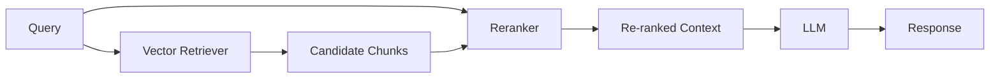

# Retrieve‑and‑Rerank RAG

```mermaid
flowchart LR
    Q[Query] --> RET[Vector Retriever]
    RET --> C[Candidate Chunks]
    Q --> RR[Reranker]
    C --> RR
    RR --> C2[Re‑ranked Context]
    C2 --> LLM[LLM]
    LLM --> R[Response]
```
