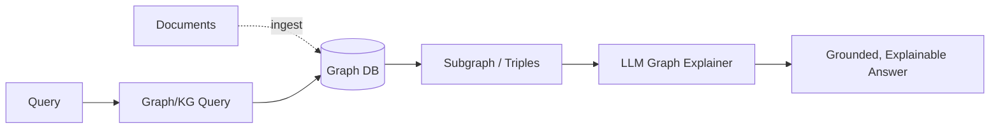

# Graph RAG

```mermaid
flowchart LR
    Q[Query] --> KGR[Graph/KG Query]
    DOCS[Documents] -.ingest.-> KG[(Graph DB)]
    KGR --> KG
    KG --> SUBG[Subgraph / Triples]
    SUBG --> EXP[LLM Graph Explainer]
    EXP --> R[Grounded, Explainable Answer]
```
