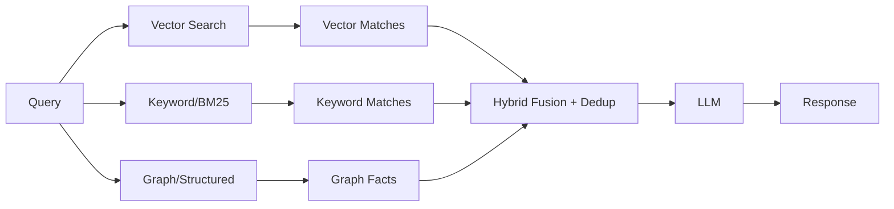

# Hybrid RAG

```mermaid
flowchart LR
    Q[Query] --> VRET[Vector Search]
    Q --> KRET[Keyword/BM25]
    Q --> GRET[Graph/Structured]
    VRET --> VCTX[Vector Matches]
    KRET --> KCTX[Keyword Matches]
    GRET --> GCTX[Graph Facts]
    VCTX & KCTX & GCTX --> FUSE[Hybrid Fusion + Dedup]
    FUSE --> LLM[LLM]
    LLM --> R[Response]
```
