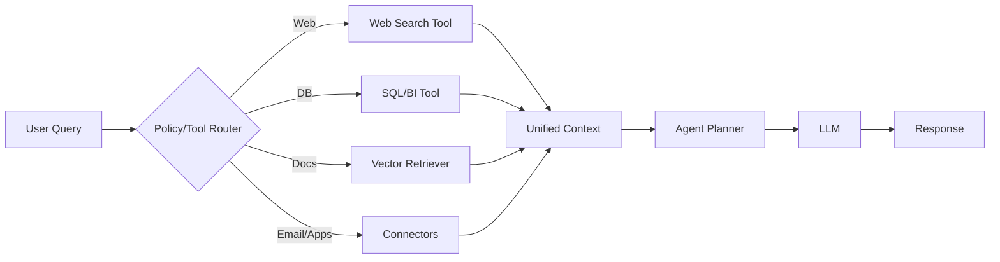

# Agentic RAG (Router)

```mermaid
flowchart LR
    Q[User Query] --> AGENT{Policy/Tool Router}
    AGENT -->|Web| WEB[Web Search Tool]
    AGENT -->|DB| DB[SQL/BI Tool]
    AGENT -->|Docs| VRET[Vector Retriever]
    AGENT -->|Email/Apps| APPS[Connectors]
    WEB & DB & VRET & APPS --> CTX[Unified Context]
    CTX --> PLAN[Agent Planner]
    PLAN --> LLM[LLM]
    LLM --> R[Response]
```
