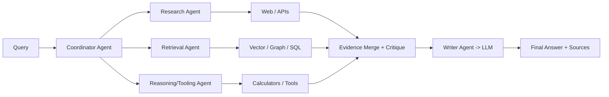

# Multi‑Agent RAG

```mermaid
flowchart LR
    Q[Query] --> CORD[Coordinator Agent]
    CORD --> R1[Research Agent]
    CORD --> R2[Retrieval Agent]
    CORD --> R3[Reasoning/Tooling Agent]
    R1 --> K1[Web / APIs]
    R2 --> K2[Vector / Graph / SQL]
    R3 --> K3[Calculators / Tools]
    K1 & K2 & K3 --> CMB[Evidence Merge + Critique]
    CMB --> WRITER[Writer Agent -> LLM]
    WRITER --> R[Final Answer + Sources]
```
